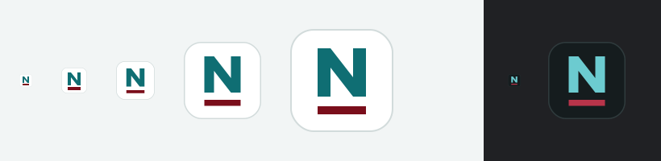

# nathanpotter.dev — tab icon ("Ruled N")

Chosen direction: a teal **N** above the maroon title rule that sits under every page heading on the site. It's drawn entirely from shapes, with no font, so it renders identically everywhere.



## Files

| File (goes in the site root) | What it is |
|---|---|
| `public/favicon.svg` | **Master icon.** It includes a `prefers-color-scheme` block, so browsers that support SVG favicons switch to the dark variant automatically |
| `public/favicon.ico` | 16, 32 and 48 px for older browsers and bookmarks. The 16 and 32 sizes use the pixel-snapped source (see below) |
| `public/apple-touch-icon.png` | 180 px, a full-bleed white square with no outline. iOS rounds the corners itself |
| `public/icon-192.png`, `public/icon-512.png` | Rounded tile with an outline, for the web manifest |
| `public/icon-maskable-512.png` | Full-bleed, with the mark kept inside the 80% safe zone so Android can crop it to any shape |
| `public/site.webmanifest` | References the three PNGs. Theme colour `#0F6E73` |
| `source/ruled-n-light.svg`, `source/ruled-n-dark.svg` | Editable sources for each theme |
| `source/ruled-n-small-16-32.svg` | A pixel-snapped variant. The N sits on a 4-unit grid and the rule is 2 px tall at 16 px, so it stays crisp in the tab |

## Add to every page's `<head>`

```html
<link rel="icon" href="/favicon.ico" sizes="32x32">
<link rel="icon" href="/favicon.svg" type="image/svg+xml">
<link rel="apple-touch-icon" href="/apple-touch-icon.png">
<link rel="manifest" href="/site.webmanifest">
<meta name="theme-color" content="#0F6E73" media="(prefers-color-scheme: light)">
<meta name="theme-color" content="#0B2F32" media="(prefers-color-scheme: dark)">
```

On Cloudflare Pages, files in the output root are served as-is. Make sure `/favicon.ico` is reachable, because some crawlers request it directly.

## Spec (64 × 64 viewBox)

| Part | Shape | Light | Dark |
|---|---|---|---|
| Tile | rect 63×63 at (.5,.5), rx 14, 1px stroke | `#FFFFFF`, stroke `#D2DBDB` | `#151C1E`, stroke `#2F3B3D` |
| N | `M17 42V12h8l14 18V12h8v30h-8L25 24v18z` | `#0F6E73` (`--brand`) | `#6CCBD0` (`--brand`, dark) |
| Rule | rect x17 y48, 30×5 | `#7A0E1B` (`--accent`) | `#B8344A` (`--accent`, dark) |

The colours match `design-handoff/tokens/tokens.css`. If the brand or accent colours change, regenerate the PNGs and the ICO from `source/`, for example with `cairosvg` or `rsvg-convert`.

## Notes

- **Contrast:** in dark mode the maroon rule is the weakest part at 16 px (about 3:1 against the dark tile). It's still visible, but subtle. Making it lighter would push it towards pink, which was rejected for the site.
- **Similar logos:** an N in a rounded square is a common shape. The nearest familiar icon is Notion's black outlined N, but teal and the maroon rule set this one apart. Nathan reviewed this and is happy to proceed.
